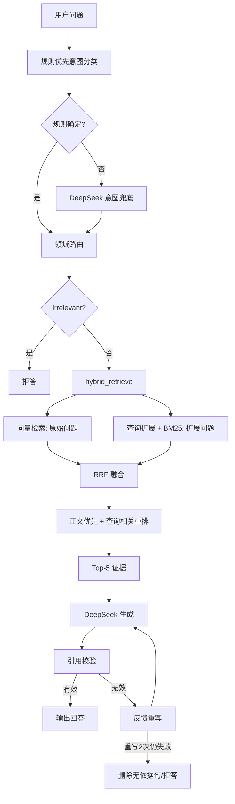

# 通用电厂设备故障根因分析与处置决策智能体

> 当前版本：2026-10-05
> 适用场景：锅炉、汽轮机、发电机及主要辅机的故障诊断与处置决策
> 主知识库：`knowledge/plant_kb/`，15,188 条记录

## 1. 项目定位

本项目面向通用电厂设备故障诊断，使用 RAG（Retrieval-Augmented Generation）从规程、运行检修资料和故障案例中检索可追溯证据，再由 DeepSeek 组织根因分析和处置建议。

系统核心目标是：

- 用规则优先的方式完成设备领域判定与检索路由；
- 用向量检索和 BM25 兼顾语义相似与专业术语精确匹配；
- 用 RRF 融合多路证据，并按正文块和查询相关性优先排序；
- 生成只能引用本次检索结果中的真实条号；
- 对无效引用自动重写，重写失败则删除无依据句或拒答。

## 2. 当前主知识库

主路径：

```text
knowledge/plant_kb/
├─ data/
│  └─ knowledge.jsonl
└─ index/
   ├─ knowledge.db
   └─ bm25_index.pkl
```

当前数据规模：

| 项目 | 数量 |
|---|---:|
| 总记录数 | 15,188 |
| 向量库 | SQLite，1,024 维 |
| BM25 索引 | `plant-bm25-v2` |

领域分布：

| 领域 | 数量 |
|---|---:|
| `auxiliary` | 1,378 |
| `boiler` | 2,864 |
| `fault_cases` | 1,081 |
| `generator_electrical` | 4,343 |
| `standards_safety` | 1,748 |
| `transformer_dga` | 544 |
| `turbine` | 3,230 |

知识库数据文件体积较大，默认不作为 Git 提交物；`knowledge/*/index/*.db` 和 `*.pkl` 已加入 `.gitignore`。

## 3. 当前技术栈

| 层 | 技术 |
|---|---|
| 语言 | Python 3.10+，开发机实测 3.14.7 |
| 向量库 | SQLite |
| Embedding | Ollama `bge-m3:latest` |
| 关键词检索 | jieba + `rank_bm25` |
| 融合 | RRF（Reciprocal Rank Fusion） |
| 生成 | DeepSeek `deepseek-chat` |
| 引用校验 | 正则提取 + 条号层级匹配 |
| 评测 | 自定义回归脚本 + Markdown 报告 |

## 4. 主链路



当前检索流程为：

```text
意图分类
  → 领域路由
  → 查询扩展
  → 向量检索（原始 query）
  → BM25 检索（扩展 query）
  → RRF 融合
  → 正文优先排序
  → 最终 Top-5
  → 生成
  → 引用校验
```

主链路不再执行第二次 `hybrid + KB` 融合。

## 5. 运行方式

### 5.1 安装与准备

```powershell
cd D:\社团考题第八
.\venv\Scripts\python.exe -m pip install -r requirements.txt
ollama pull bge-m3:latest
```

在项目根目录 `.env` 中配置：

```dotenv
DEEPSEEK_API_KEY=你的APIKey
```

### 5.2 使用最新 plant_kb

```powershell
$env:KB_BACKEND="plant_kb"
$env:USE_ROUTER="true"

.\venv\Scripts\python.exe main.py "汽轮机振动"
```

开启调试摘要：

```powershell
.\venv\Scripts\python.exe main.py "汽轮机振动" --debug
```

交互模式：

```powershell
.\venv\Scripts\python.exe main.py
```

输入 `exit`、`quit` 或 `退出` 结束交互模式。

## 6. 环境变量

| 变量 | 默认值 | 说明 |
|---|---:|---|
| `KB_BACKEND` | `plant_kb` | 选择 `plant_kb` 或 `pure_kb` |
| `USE_ROUTER` | `true` | 使用意图路由；`false` 回退直接 hybrid 检索 |
| `DEEPSEEK_API_KEY` | 空 | DeepSeek API Key |
| `DEEPSEEK_API_BASE` | `https://api.deepseek.com` | API 地址 |
| `DEEPSEEK_MODEL` | `deepseek-chat` | 生成模型 |

`KB_BACKEND` 和 `USE_ROUTER` 需要设置在 PowerShell 环境中；`.env` 当前主要用于读取 `DEEPSEEK_API_KEY`。

## 7. 目录结构

```text
.
├─ main.py
├─ requirements.txt
├─ README.md
├─ data/
│  ├─ rules/
│  │  ├─ intent_rules.json
│  │  └─ synonym_rules.json
│  └─ evaluation/
├─ knowledge/
│  ├─ pure_kb/
│  │  ├─ data/
│  │  └─ index/
│  └─ plant_kb/
│     ├─ data/
│     └─ index/
├─ vector_kb/
│  ├─ intent_classifier.py
│  ├─ intent_router.py
│  ├─ retrieval_router.py
│  ├─ query_expander.py
│  ├─ hybrid_retriever.py
│  ├─ retrieval.py
│  ├─ bm25_retriever.py
│  ├─ rrf_fusion.py
│  ├─ chunk_filter.py
│  ├─ generation.py
│  ├─ citation_verifier.py
│  ├─ embeddings.py
│  └─ knowledge_base_adapter.py  # 旧 KB 接口，已标记 deprecated
├─ scripts/
│  ├─ run_regression.py
│  ├─ shadow_ab_test.py
│  ├─ tune_rrf_weights.py
│  ├─ build_sharded_bm25.py
│  ├─ profile_performance.py
│  └─ run_plant_kb_api_test.py
├─ docs/
│  ├─ README.md
│  ├─ 00_项目管理/
│  ├─ 01_调研与方案/
│  ├─ 02_知识库与数据/
│  ├─ 03_检索与排序/
│  ├─ 04_评测与回归/
│  ├─ 05_架构与交付/
│  └─ 06_论文与笔记/
└─ backups/
```

## 8. 当前检索配置

| 参数 | 当前值 |
|---|---:|
| 向量相似度阈值 | `0.45` |
| hybrid 候选池 | `candidate_k=300` |
| 向量/BM25 融合 | RRF，`k=60` |
| 最终上下文 | Top-5 |
| BM25 加载 | `domains` 非空时按域加载 `bm25_{domain}.pkl` 分片；为空时回退全量索引 |
| 向量加载 | `domains` 非空时 SQL 按域读取并缓存；为空时读取全表 |
| 查询扩展 | 仅 BM25 使用扩展 query |
| 多域结果 | 保留每个目标域的最高排名结果 |
| 引用重写 | 最多 2 次 |

`candidate_k=300` 是当前为保证靠后证据召回而保留的临时配置，后续在查询规划、Reranker 和知识库质量稳定后应调低。

## 9. 引用规则

- `doc_id` 和 `clause` 都存在时，条文才标记为可引用；
- `clause` 为空时，可进入背景上下文，但不能生成引用；
- `citation_verifier.py` 支持：
  - 完全条号匹配；
  - 合并条号拆分匹配；
  - 父子条号匹配，如 `16.3.2` 与 `16.3`；
  - 表号规范化，如 `9.3.1-表3`；
- `doc_id` 不同则引用无效；
- 无效引用最多触发 2 次重写，失败后删除无依据句或拒答。

## 10. 测试与回归

当前回归脚本支持：

```powershell
python scripts\run_regression.py --smoke
python scripts\run_regression.py --core
python scripts\run_regression.py --full
```

当前结果：

| 模式 | 通过 | 失败 | 说明 |
|---|---:|---:|---|
| smoke | 8/8 | 0 | 快速冒烟 |
| core | 24/24 | 0 | 核心模块回归 |
| full | 138/138 | 0 | 端到端评测；来源 83/116，条号 46/73 |

回归报告目录：

```text
docs/04_评测与回归/
```

历史评测还包括：

- 50 条 DGA 离线用例：39 条可评，Top-5 命中 30 条，命中率 76.92%；
- 138 条通用设备真实 API 快照：来源命中 @5 为 26.72%，关键词覆盖率 21.79%，平均响应 2,537.40 ms；
- 7 条真实 DeepSeek A/B：Top-5 命中率 50% → 83.33%，样本较小。

历史数字不代表当前新链路最终质量，应结合最新回归和知识库版本阅读。

## 11. 已知问题

1. `plant_kb` 仍存在 OCR 文本噪声、页码缺失和部分空条号问题。
2. `candidate_k=300` 是当前召回保障配置，后续可通过查询规划、Reranker 和更小候选池优化。
3. v3 分层映射已通过 domain_mapping 适配层兼容，后续仍可做专项规范化。
4. 多域检索已能在主域检索阶段纳入相邻域，残余来源/条号未命中主要来自 OCR 和排序质量。
5. Reranker、OCR 重切块和更细粒度精排仍是后续优化项，不阻塞当前提交。
6. C6 FaultSeer 式多步 Agentic 路由尚未实现，当前为受控单轮 RAG 流程。

## 12. 文档入口

- [实现方案与架构](docs/00_项目管理/09_implementation_plan.md)
- [验收与评测记录](docs/00_项目管理/08_acceptance_record.md)
- [开发日志与日程](docs/00_项目管理/05_dev_log_and_schedule.md)
- [项目状态](docs/00_项目管理/00_project_status.md)
- [文档导航](docs/README.md)
- [回归测试报告](docs/04_评测与回归/回归测试报告_20261003.md)
- [性能基准测试](docs/03_检索与排序/性能基准测试.md)
- [BM25 分片优化报告](docs/02_知识库与数据/BM25分片优化报告.md)
- [向量检索优化报告](docs/02_知识库与数据/向量检索优化报告.md)
- [138题端到端评测报告](docs/04_评测与回归/评测报告_138题_20261004.md)
- [向量检索短板诊断](docs/03_检索与排序/向量检索短板诊断.md)
- [代码清理记录](docs/00_项目管理/代码清理记录.md)
- [文献与标准](docs/01_调研与方案/01_literature_and_standards.md)

## 13. 版权与安全边界

- 标准原文、论文 PDF、第三方材料和 API Key 不提交 Git；
- 大体积 JSONL、SQLite 和 BM25 索引默认不提交；
- 系统输出不能替代人工复核；
- 涉及停运、检修、隔离、送电和带电作业的建议必须保留人工确认关口。