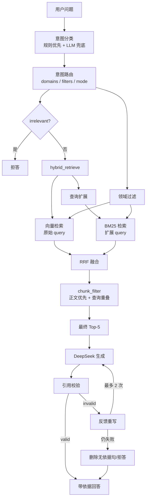

# 通用电厂设备故障诊断项目实现方案

> **当前项目口径（2026-10-03）**：项目主对象已转为“通用电厂设备故障诊断”，覆盖锅炉、汽轮机、发电机及主要辅机。DGA 仅保留为可选专项、历史技术资产或备用能力，不再作为主链路范围。
>
> 文档状态：现行｜更新：2026-10-03
> 当前主入口：根目录 `main.py`
> 本文合并原有实现方案与独立架构说明，作为当前系统架构、主链路、模块职责和实施路线的统一入口。

## 1. 设计目标与原则

系统面向锅炉、汽轮机、发电机和主要辅机，目标是把设备异常现象转化为有依据、可校验、可拒答的诊断辅助结果。

设计原则：

1. 规则优先：意图和设备域判断优先使用确定性规则，规则无法判断时才调用 LLM。
2. 双路召回：向量检索负责语义相似，BM25 负责专业术语和关键词精确匹配。
3. 分层融合：RRF 合并排名，正文过滤和查询相关性重排决定最终 Top-5。
4. 可溯源：回答引用必须来自本次检索结果，禁止引用不存在条号。
5. 安全边界：系统只提供辅助诊断和依据整理，停运、检修和带电操作保留人工复核。
6. 可回退：通过 `KB_BACKEND` 和 `USE_ROUTER` 保持旧库与旧检索路径的回退能力。

## 2. 总体架构



## 3. 当前主链路

实际调用顺序：

```text
main.py
  -> classify_intent
  -> route_intent
  -> hybrid_retrieve
       1. retrieve(original_query, domains)
       2. expand_query(question, intent)
       3. bm25_retrieve(expanded_query, domains)
       4. rrf_fusion
       5. prioritize_results
  -> generate
  -> verify_citations
  -> 最多重写 2 次
  -> 删除无依据句或拒答
```

主链路的检索入口为 `vector_kb/retrieval_router.py` 中的 `route_and_retrieve()`。当前结果直接使用 hybrid 融合后的 Top-5，不再执行第二次 `hybrid + KB` 融合。

### 3.1 当前运行参数

| 参数 | 当前值 | 说明 |
|---|---:|---|
| 向量相似度阈值 | `0.45` | 低于阈值的结果不进入向量候选 |
| hybrid 候选池 | `candidate_k=300` | 为缓解目标条文排名靠后而保留的临时配置 |
| RRF 平滑常数 | `k=60` | 向量与 BM25 按排名融合 |
| 最终上下文 | Top-5 | 仅 Top-5 证据送入生成 |
| 查询扩展 | 仅 BM25 | 向量使用原始 query，BM25 使用扩展 query |
| 多域覆盖 | 保留目标域最高排名结果 | 避免多意图问题被单一领域占满 |
| 引用重写 | 最多 2 次 | 重写失败后删除无依据句或拒答 |

## 4. 模块职责

| 模块 | 文件 | 职责 |
|---|---|---|
| 主入口 | `main.py` | CLI、交互模式、debug 流程、生成与引用校验编排 |
| 意图分类 | `vector_kb/intent_classifier.py` | 规则优先、LLM 兜底、多意图识别 |
| 意图路由 | `vector_kb/intent_router.py` | 意图到 domains / filters / mode 的映射 |
| 查询扩展 | `vector_kb/query_expander.py` | 加载同义词表，为 BM25 生成扩展 query |
| 检索调度 | `vector_kb/retrieval_router.py` | 串联意图识别、domain 路由和 hybrid 检索 |
| 混合检索 | `vector_kb/hybrid_retriever.py` | 按 `KB_BACKEND` 选择数据源，执行向量 + BM25 + RRF |
| 向量检索 | `vector_kb/retrieval.py` | SQLite 向量加载、schema 探测、domain 过滤、余弦检索 |
| BM25 | `vector_kb/bm25_retriever.py` | JSONL/索引加载、`plant-bm25-v2` 支持、domain 过滤 |
| RRF | `vector_kb/rrf_fusion.py` | 按排名融合向量和 BM25 结果 |
| 正文排序 | `vector_kb/chunk_filter.py` | 正文判定、查询重叠度、正文优先重排 |
| 生成 | `vector_kb/generation.py` | 上下文拼接、DeepSeek 调用和引用格式约束 |
| 引用校验 | `vector_kb/citation_verifier.py` | 条号提取、层级匹配、重写提示、无效句删除 |
| 领域过滤 | `vector_kb/domain_guard.py` | 排除明显无关问题，按后端适配领域词表 |
| 数据适配 | `vector_kb/knowledge_base_adapter.py` | 旧 KB 接口和字段兼容；主链路已不调用，文件标记 deprecated |
| 回归测试 | `scripts/run_regression.py` | smoke/core/full 分层回归，兼容 legacy/current |

## 5. 知识库分层设计

### 5.1 领域层

当前主知识库为 `knowledge/plant_kb/`，共 15,188 条记录，包含七个领域：

| 领域 | 数量 | 主要范围 |
|---|---:|---|
| `boiler` | 2,864 | 锅炉本体、受热面、制粉和燃烧系统 |
| `turbine` | 3,230 | 汽轮机本体、通流、轴承、调速和凝汽器 |
| `generator_electrical` | 4,343 | 发电机本体、定子、转子、励磁和电气系统 |
| `auxiliary` | 1,378 | 风机、水泵、油系统和冷却系统 |
| `standards_safety` | 1,748 | 安全操作、检修、隔离和处置规范 |
| `fault_cases` | 1,081 | 故障案例和现场记录 |
| `transformer_dga` | 544 | 变压器与 DGA 专项内容 |

检索时通过 `domains` 对向量和 BM25 同时过滤，避免锅炉问题混入汽轮机或辅机内容。

### 5.2 证据类型层

v3 候选知识库进一步增加分层字段：

| 字段 | 含义 |
|---|---|
| `scope` | `device_specific`、`procedure`、`component_generic`、`instrument_generic` |
| `evidence_kind` | `procedure`、`direct`、`generic_mechanism` |
| `scope_confidence` | 分层置信度 |
| `applies_to` | 适用设备或部件 |
| `component` | 部件类型 |
| `fault_type` | 故障类型 |

设计优先级：

```text
具体设备专项证据
  > 具体规程/处置过程
  > 同类部件通用故障机理
  > 仪表/控制系统通用机理
```

数据本体与 DB/BM25 哈希已验证；但 v3 的 `failure_mode_rules.json` 中文内容损坏，规则层尚未正式接入。主链路当前主要依赖领域、条号、正文和引用校验。

### 5.3 数据文件

```text
knowledge/plant_kb/data/knowledge.jsonl
knowledge/plant_kb/index/knowledge.db
knowledge/plant_kb/index/bm25_index.pkl
```

当前 BM25 版本为 `plant-bm25-v2`。向量库和数据文件体积较大，默认不作为 Git 提交物。

## 6. 检索策略

### 6.1 向量检索

- 查询使用原始用户问题；
- 支持 `chunks` 和 plant_kb `knowledge` 两种 SQLite schema；
- 从 SQLite 读取向量；
- 按 `domain` 过滤；
- 使用余弦相似度；
- 默认低于阈值的结果不进入结果集。

### 6.2 BM25

- 使用 jieba 分词和 `rank_bm25`；
- 查询使用扩展后的 BM25 query；
- 支持 `plant-bm25-v2`；
- 支持 domain 过滤；
- 对没有 domain 的历史记录保持兼容。

### 6.3 RRF

- 向量和 BM25 排名按 `1/(k+rank)` 融合；
- 当前 `k=60`；
- 不直接比较原始分数，只使用排名；
- 多域检索时额外保留各目标域的最高排名结果。

### 6.4 正文优先重排

`chunk_filter.py` 使用：

- 文本长度；
- 标题模式；
- 标点和动作词；
- 标题性结尾；
- 查询 n-gram 重叠度。

排序策略：

```text
正文块优先
-> 查询相关度更高
-> RRF 分数更高
```

## 7. 生成与引用校验

### 7.1 生成

`generation.py`：

- 只拼接检索得到的 chunks；
- `citation_eligible=True` 的条文可以生成【依据：...】；
- 不可引用条文只作为背景资料；
- 生成失败或未命中时拒答。

### 7.2 引用校验

`citation_verifier.py` 支持：

- 完全匹配；
- 合并条号拆分；
- 父子条号匹配；
- 表号规范化；
- `doc_id` 校验；
- 最多两次重写；
- 删除无效引用句。

例如：

```text
16.3.2 -> 16.3 -> 16.1/16.2/16.3
```

引用校验通过只证明条号存在于检索结果，不等价于答案语义正确。

## 8. 设计依据

| 依据 | 本项目采用方式 |
|---|---|
| RCAgent | 工具编排、专家工具分层、证据可验证、结构化输出 |
| RAG 综述 | Advanced/Modular RAG：检索后处理、融合、模块化检索器 |
| EvLink / evidence linking | 将结论与检索证据建立可追溯关系 |
| RARR / CRAG 类方法 | 生成后检查、无依据内容修订或删除 |
| FaultSeer（C6） | 后续 Agentic 路由和多步证据规划方向，当前尚未完整实现 |

本项目的 Agentic 部分目前是受控的单轮 RAG 工作流，不是完全自动的多步 Agent。

## 9. 数据组织与边界

### 9.1 公开可提交内容

- 代码、脚本和测试；
- 文档、日志、验收记录和调研报告；
- 经人工整理的事实性判据参数；
- 规则标识、条号来源和自撰摘要；
- 公开数据整理后的数值表。

### 9.2 本地不提交内容

- 标准 PDF 和正文转写；
- 大体积 JSONL、SQLite 向量库和 BM25 索引；
- 第三方原始 xlsx；
- `.env` 和 API Key；
- `literature/`、`source_materials/`、`submissions_pending_review/`。

### 9.3 可复现性边界

公开仓库可以复现代码、规则和评测脚本。完整知识库依赖本地合法材料和成员交付包，干净 clone 不保证单独重建全量数据，文档必须明确标注这一边界。

## 10. 当前接口

### 10.1 检索

```python
route_and_retrieve(
    question: str,
    top_k: int = 5,
    shadow: bool = True,
    trace=None,
) -> dict
```

返回字段：

```text
chunks / source / intent / route / hybrid_top5 / kb_top5 / llm_calls
```

当前 `source` 为 `hybrid`，`kb_top5` 留作兼容字段。

### 10.2 生成

```python
generate(question: str, chunks: list[dict]) -> str
```

- chunks 为空时不调用 API；
- 模型默认 `deepseek-chat`；
- 生成只依据检索条文回答。

### 10.3 引用校验

```python
verify_citations(answer: str, chunks: list[dict]) -> dict
remove_invalid_citation_sentences(answer: str, chunks: list[dict]) -> str
build_retry_prompt(question: str, verification: dict, chunks: list[dict]) -> str
```

### 10.4 可选 DGA 规则接口

`scripts/dga_ratio.py` 和数值 DGA 结构化输入保留为可选专项，不再作为通用设备主链路 P0。

## 11. 评测方案

### 11.1 检索指标

- Top-5 命中率；
- 来源命中 @5；
- 多意图覆盖；
- 跨域干扰率；
- 无关问题拒答率；
- 平均响应时间。

### 11.2 生成与合规指标

- 引用正确率；
- 引用覆盖率；
- 无依据断言率；
- 危险建议拦截率；
- 人工复核触发正确率。

### 11.3 当前评测基线

| 组别 | 结果 |
|---|---|
| smoke | 8 条：8 通过、0 失败 |
| core | 24 条：24 通过、0 失败 |
| full | 138 条：136 通过、2 失败 |
| 当前 138 题端到端评测 | Top-5 来源命中 56/116（48.28%），引用校验 136/138（98.55%） |
| 历史 50 条 DGA 离线评测 | Top-5 76.92%（30/39） |
| 历史 138 题真实 API 快照 | 来源命中 @5 26.72%，关键词覆盖 21.79%，平均 2,537.40 ms |

评测明细与已知问题见 [`docs/08_acceptance_record.md`](08_acceptance_record.md)、[`评测报告_138题_20261004.md`](评测报告_138题_20261004.md) 和 [`回归测试分层汇总_20261004.md`](回归测试分层汇总_20261004.md)。

## 12. 分阶段实施计划

### 阶段 A：项目启动与基础检索（已完成）

- 建立 Python、SQLite、Ollama 向量检索原型；
- 建立第一版条文语料和标准 chunk 格式；
- 验证向量检索基础链路。

### 阶段 B：DGA 混合检索与引用闭环（已完成）

- 接入 BM25、RRF、DeepSeek 生成和引用校验；
- 建立规则优先、LLM 兜底的意图分类；
- 建立 24 项回归和 shadow A/B 测试。

### 阶段 C：通用电厂设备迁移（已完成骨架）

- 主知识库切换为 plant_kb；
- 意图类别切换为锅炉、汽轮机、发电机、辅机、安全、变压器和无关问题；
- 实现 domain 过滤、查询扩展、正文优先重排和引用层级校验；
- 拆分 legacy/current 回归。

### 阶段 D：排序和质量提升（当前）

- [ ] 修复 v3 `failure_mode_rules.json` 编码；
- [ ] 接入 `scope / evidence_kind / applies_to` 分层字段；
- [x] 执行当前版本 138 题端到端复测；
- [x] 建立 smoke/core/full 分层回归；
- [ ] 评估 Reranker 和查询规划；
- [ ] 将 `candidate_k` 从 300 调回合理范围；
- [ ] 继续减少来源未命中题。

### 阶段 E：受控 Agent 与增强证据（后置）

- [ ] 有限步骤 Agent 状态机；
- [ ] 工具白名单和证据 ID；
- [ ] 故障模式关系图；
- [ ] 多模态和案例库作为辅助证据。

## 13. 当前下一步

1. 验证并接入 v3 分层规则文件。
2. 修复 `FULL-088`、`FULL-089` 的引用解析问题。
3. 对 Top-10/20 候选进行 Reranker 或查询规划实验。
4. 评估是否降低 `candidate_k=300`。
5. 更新生成提示词和报告结构，使其完全适配通用电厂设备。
6. 保持 README、docs/00、docs/05、docs/08、docs/09 与本文件一致。

## 14. 最终验收标准

- [ ] `KB_BACKEND=plant_kb` 时，锅炉、汽轮机、发电机和辅机问题均能进入正确领域；
- [ ] 无关问题稳定拒答；
- [ ] 多意图问题能够覆盖多个目标领域；
- [ ] 所有引用都能在本次检索结果中找到；
- [ ] 不可引用条文不生成依据条号；
- [ ] 层级条号和合并条号校验通过；
- [ ] current 回归全部通过；
- [x] 当前 138 题端到端复测完成；
- [ ] 最终文档明确当前能力、局限和本地可复现边界。